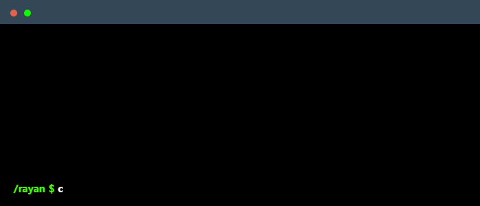

<!--
    Hey there, I'm Rayan Elaini!
    Welcome to my GitHub profile.
    Feel free to explore & connect!
-->

 

---

### Main skills

### Studying

- **Frontend:** React, Next.js, TailwindCSS, Elementor  
- **Backend:** Node.js, Express, MongoDB, MySQL  
- **Design & Branding:** Photoshop, Illustrator, Figma, Adobe Premiere/After Effects  
- **CMS & SEO:** WordPress, WooCommerce, On-page SEO
  
---

  

---

### Featured Projects
- **Technichome** – Corporate site for technical services with custom Elementor forms → [View](https://www.technichome.ch)  
- **Fortunes Club** – T-shirt e-commerce with custom landing pages & brand setup → [View](https://fortunes-club.com)  
- **Borne Recharge** – EV charging solution showcase with conversion-oriented design → [View](https://borne-recharge.ch)  
- **Pompe à Chaleur** – Heat pump installation service website → [View](https://pompechaleur.ch)  
- **Batterie Solaire** – Swiss solar battery solutions with multi-brand integration → [View](https://batterie-solaire.ch)  
- **TailTrail** – Mobile pet grooming website with local SEO optimization → [View](https://tailtrail.ca)  
- **MERN Web App** – Full-stack application with authentication, dashboard, and CRUD → [View](https://github.com/rayan-ea/projet)  

---

### Connect with me!

    
    
    

---

### Employers
> [!IMPORTANT]  
> [**Download my resume here**](https://github.com/rayan-ea/rayan-ea/blob/main/Cv%20Rayan%20Elaini%20Dev.pdf)

